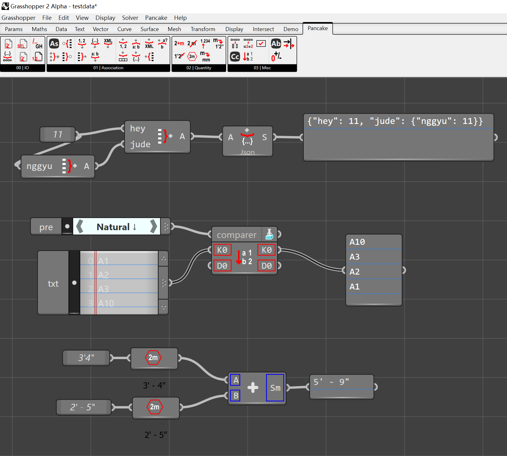

# Pancake for Grasshopper 2

A open-source port of [Pancake](https://www.food4rhino.com/en/app/pancake) for GH2. The project primarily serves as a technical demonstration and is not as feature-complete as its GH1 counterpart.

Moreover, please note that Pancake introduces additional abstraction layers for localization and other purposes, so its code may differ from typical GH2 components.

# Porting Handbook

See the [Wiki](https://github.com/karakasa/PancakeNext/wiki) for a quick-start guide and other topics, including an overview of the new data model in GH2.

# Example: One Codebase for Both GH1 & GH2

[Codebase](/example/OneCodeTwoVersions)

This example uses project configurations, preprocessor directives, and a thin compatibility layer to support both Grasshopper 1 and 2 from a single codebase. The compatibility layer is designed around GH1 conventions, allowing the same logic to run in GH2 with minimal changes. Pancake itself doesn't use this due to its deep integration with Grasshopper.

> Note: This project is intended as a technical demonstration. The APIs and interoperability layers follow the terms and conditions defined by McNeel and David Rutten for Grasshopper 1.

# License

[Apache-2.0](LICENSE.txt)

In short:
* No warranty.
* Free for non-commercial and commercial use.
* Attribution required in modified files, if you make derivative works of this repo.

